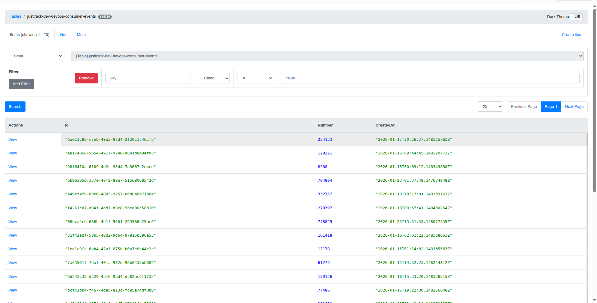

# Cloud‑Native Event‑Driven Pipeline (Kubernetes + Crossplane + LocalStack)

## Overview

This project implements a **local, cloud‑native, event‑driven architecture** on Kubernetes using AWS services emulated by **LocalStack**, fully **provisioned via Crossplane**, with application workloads deployed using **Helm**.

### Architecture

```
Producer
   ↓
SNS Topic
   ↓
SQS Queue
   ↓
Consumer
   ↓
DynamoDB
```

A **DynamoDB Admin UI** is provided to inspect the DynamoDB table and stored items.

---

## Environment & Requirements

* Kubernetes (Docker Desktop 4.40+ with Kubernetes enabled)
* LocalStack (Docker Desktop Extension)
* Crossplane
* Helm
* kubectl
* aws‑cli

**Region:** `eu-central-1`


---


Verification:

```bash
aws --endpoint-url http://localhost:4566 sns list-topics
aws --endpoint-url http://localhost:4566 sqs list-queues
aws --endpoint-url http://localhost:4566 sns list-subscriptions
aws --endpoint-url http://localhost:4566 dynamodb list-tables
```

```bash
kubectl get topics,queues,queuepolicies,topicsubscriptions,tables.dynamodb.aws.upbound.io
```


---

## Applications (Deployed with Helm)

Applications are packaged and deployed using Helm charts.

### Producer

* Image: `ghcr.io/justtrackio/devopstest-producer:latest`
* Environment:

```yaml
CLOUD_AWS_DEFAULTS_ENDPOINT=http://localstack.devopstest.svc.cluster.local:4566
```

### Consumer

* Image: `ghcr.io/justtrackio/devopstest-consumer:latest`
* Environment:

```yaml
CLOUD_AWS_DEFAULTS_ENDPOINT=http://localstack.devopstest.svc.cluster.local:4566
```

### DynamoDB Admin UI

* Image: `aaronshaf/dynamodb-admin`
* Connected to LocalStack DynamoDB
* Exposed via NGINX Ingress

---

## Networking

* LocalStack runs outside Kubernetes and is exposed internally via:

  * `Service` + `Endpoints`
* NGINX Ingress routes traffic:

  * `dynamodb.domain.tld` → DynamoDB Admin UI
  * `localstack.domain.tld` → LocalStack (restricted by source IP)

Ingress access is restricted using:

```yaml
nginx.ingress.kubernetes.io/whitelist-source-range
```

---

## Deployment

### 1. Infrastructure (Crossplane)

```bash
cd crossplane
kubectl apply -f provider.yml
kubectl apply -f localstack-cred.yml
kubectl apply -f sns-topic.yml
kubectl apply -f sqs-queue.yml
kubectl apply -f sqs-policy.yml
kubectl apply -f sns-subscription.yml
kubectl apply -f dynamodb-table.yml
```

### 2. Applications (Helm)

```bash
cd helm && helm upgrade --install justtrack-t1 ./justtrack-t1 -n devopstest
```


---

## Verification

### Pods

```bash
kubectl -n devopstest get pods
```

All pods must be **Running**:

* producer
* consumer
* dynamodb-admin

### Data Flow Validation

* Producer publishes events to SNS
* SNS delivers messages to SQS
* Consumer reads messages from SQS
* Consumer writes items into DynamoDB


---


## Design Decisions

* **Crossplane** used for all infrastructure provisioning
* **Helm** used for all application deployments
* Clear separation of infrastructure and workloads
* Declarative, reproducible setup
* Minimal manual configuration

---

## Result

 All success criteria met

* End‑to‑end event‑driven data flow works
* Infrastructure is fully declarative
* Applications are Helm‑managed
* Setup is clean, reproducible, and production‑grade



